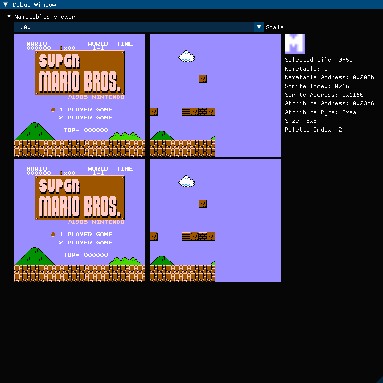
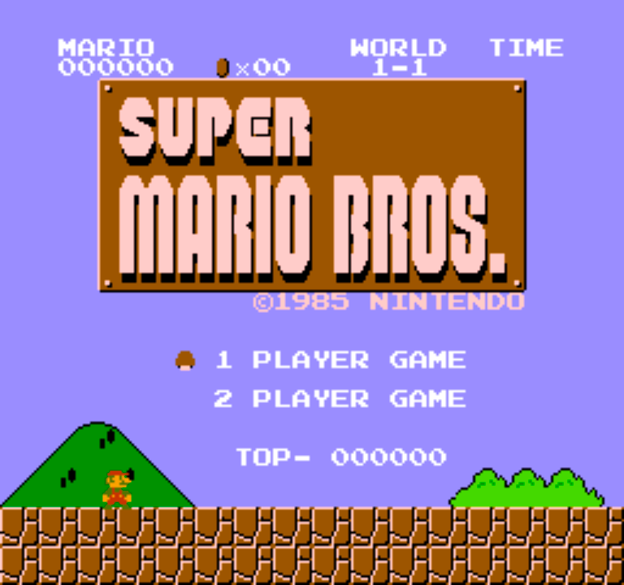

# NES Emulator
This is a work-in-progress NES emulator being made for learning purposes

## Technologies used
- **C++ 17**: Programming language
- [**SDL3**](https://github.com/libsdl-org/SDL): Graphics and audio rendering
- [**Dear ImGui**](https://github.com/ocornut/imgui): Debugger UI

## Current Progress

- [x] **CPU** — Functional*(Missing illegal instructions)
- [x] **PPU** — Functional*
- [ ] **APU** — Pulse channels partly functional**
- [ ] **Debugger** — Real-time nametables viewer

\* Passes basic test ROMs, but timing/accuracy are still in progress.  
\** Sweep unit not fully functional.

## Mappers Implemented
- [Mapper 0](https://www.nesdev.org/wiki/NROM)
- [Mapper 002](https://www.nesdev.org/wiki/UxROM)
- [Mapper 003](https://www.nesdev.org/wiki/CNROM)

## Images

## References
- [Nesdev](https://www.nesdev.org/wiki/Nesdev_Wiki)
- [amhndu's SimpleNES](https://github.com/amhndu/SimpleNES)
- [javidx9](https://youtube.com/playlist?list=PLrOv9FMX8xJHqMvSGB_9G9nZZ_4IgteYf&si=DCBgEVOxeWQLPTZ8)
- [amaiorano's nes-emu](https://github.com/amaiorano/nes-emu)
- [Emulating PPU Registers](https://bugzmanov.github.io/nes_ebook/chapter_6_1.html)
- [6502.org](http://www.6502.org/tutorials/6502opcodes.html)
- [6502 Instruction Set](https://www.masswerk.at/6502/6502_instruction_set.html)
- [Ultimate Commodore 64 Reference](https://www.pagetable.com/c64ref/6502/?tab=2)